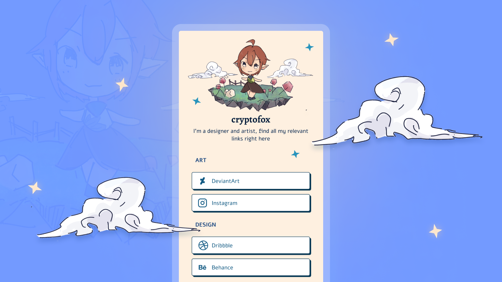

## About the project

I wanted to create a link-in-bio webpage. Although there are many services and templates available I thought it would be fun to design and code one from scratch. 

It took me nearly 3 days to complete it since I spent a lot of time on the illustration and design. 

Overall I enjoyed the process and I got explore and use some new tools ([Polypane](https://polypane.app/) and [Clip Studio Paint](https://www.clipstudio.net/en/)).

Also feel free to use the template design (but not the illustration).

## Credits 

Icons used are from [Iconmonstr](https://iconmonstr.com/)